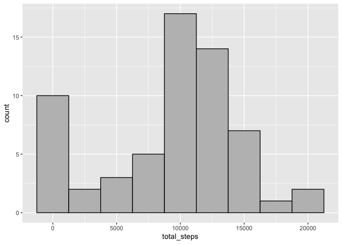
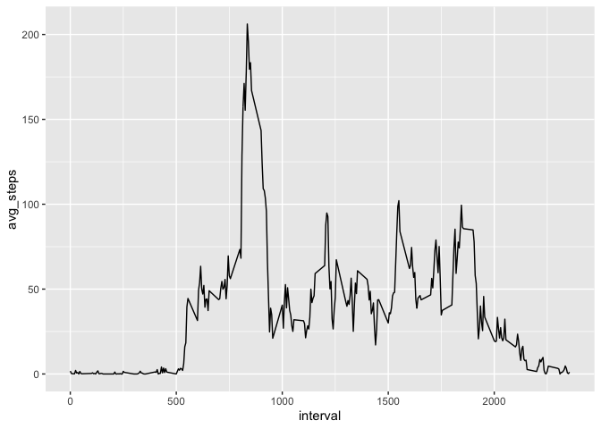
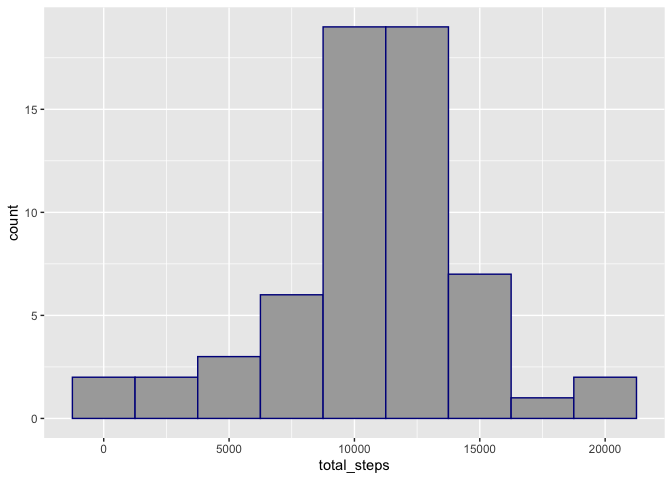
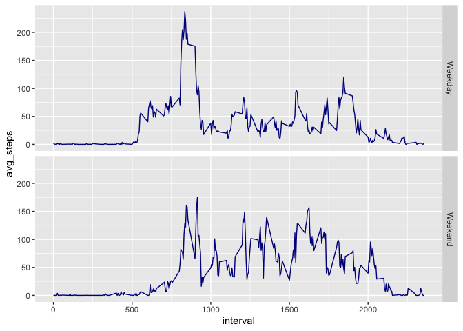

This is a markdown file for the Coursera reproducible research course - project 1. The following code has been written utilising the tidyverse group of packages.


```r
# Set global options for code chunks and load packages
knitr::opts_chunk$set(echo=TRUE, message = FALSE)
library(tidyverse)
```


## Loading and preprocessing the data

The data is presented in a tidy format, however the date column needs to be converted to *date* format data.


```r
orig_data <- read.csv("activity.csv")
data <- orig_data %>%
        mutate(date = as.Date(date, "%Y-%m-%d"))
```


## What is mean total number of steps taken per day?

In order to answer this question, we need to group the data by date, then calculate the total number of steps recorded per day. *NA's* have been ingnored for this calcuation.

A histogram plotting just the total steps per day show two distinct peaks - one at zero, where no steps have been recorded, the other around the 10,000 step mark.


```r
# Prepare data for histogram
hist_data <- data %>%
        group_by(date) %>%
        summarise(total_steps = sum(steps, na.rm = TRUE))

# Histogram - total steps per day
hist_data %>%
        ggplot(aes(total_steps)) +
        geom_histogram(color = "black",
                       fill = "grey",
                       binwidth = 2500)
```

<!-- -->

A little more code is required to calculate the mean and median:


```r
# Calculate mean and median for total steps per day
stats <- hist_data %>%
        summarise(mean = mean(total_steps),
                  median = median(total_steps))
stats
```

```
## # A tibble: 1 x 2
##    mean median
##   <dbl>  <int>
## 1 9354.  10395
```


## What is the average daily activity pattern?

We are now looking at the average number of steps per interval, so data needs to be grouped by interval, and the average steps calculated. Again ignoring *NA's*. This is visualised through a time series plot.


```r
# Prepare data for time series plot
tsplot_data <- data %>%
        group_by(interval) %>%
        summarise(avg_steps = mean(steps, na.rm = TRUE))

# Time series plot = average number of steps for each interval
tsplot_data %>% ggplot(aes(interval, avg_steps)) + geom_line()
```

<!-- -->

```r
# Which interval, on average, has the maxmimum number of steps per day 
max_interval <- tsplot_data %>% filter(avg_steps == max(avg_steps))
```

The times series plot shows a clear peak at **interval 835** which has the highest average number of steps per day.


## Imputing missing values
Up to now the *NA* values have been excluded from any calculations. However they could alter the analysis if included. So this following section explores how the data may look with missing values imputed.

#### How much data is missing?
How many missing values are there?


```r
# How many rows in the dataset have missing values?
missing <- sum(!complete.cases(data))
```
There are 2304 observations with missing data.

#### Filling the gaps
For this analysis, the *NA* value will be imputed using the mean value for the timelot and day of the week. Limited thought has gone into selecting this method.


```r
# Calculating the imputed values in a new data set using mean by interval and
# week day. Also adding weekend factor variable for later use
imp_data <- data %>%
        mutate(weekday = weekdays(date, abbreviate = TRUE),
               weekend = factor(ifelse(weekday %in% c("Sat", "Sun"),
                                "Weekend",
                                "Weekday"))) %>%
        group_by(interval, weekday) %>%
        mutate(steps = replace_na(steps, mean(steps, na.rm = TRUE)))
```

Histogram with the imputed data included:


```r
# Summarising data by date for an updated histogram
hist2_data <- imp_data %>%
        group_by(date) %>%
        summarise(total_steps = sum(steps))

# Plot the histogram (showing both the original data, and the imputed data)
hist2_data %>%
        ggplot(aes(total_steps)) +
        geom_histogram(color = "dark blue",
                       fill = "dark grey",
                       binwidth = 2500)
```

<!-- -->

Calculating the mean and median for the imputed data:


```r
# Calcualte the mean and median including the imputed data
stats2 <- hist2_data %>% summarise(mean = mean(total_steps),
                                   median = median(total_steps))
stats2
```

```
## # A tibble: 1 x 2
##     mean median
##    <dbl>  <dbl>
## 1 10821.  11015
```

The mean and median have both increased when the imputed data is included.

## Are there differences in activity patterns between weekdays and weekends?

Comparing average weekday activity with weekend activity:


```r
# Prepare date for time series plot
tsplot2_data <- imp_data %>%
        group_by(weekend, interval) %>%
        summarise(avg_steps = mean(steps))

# ggplot version
# Time series plot = average number of steps for each interval
tsplot2_data %>%
        ggplot(aes(interval, avg_steps)) +
        geom_line(color = "dark blue") +
        facet_grid(weekend ~ .)
```

<!-- -->


